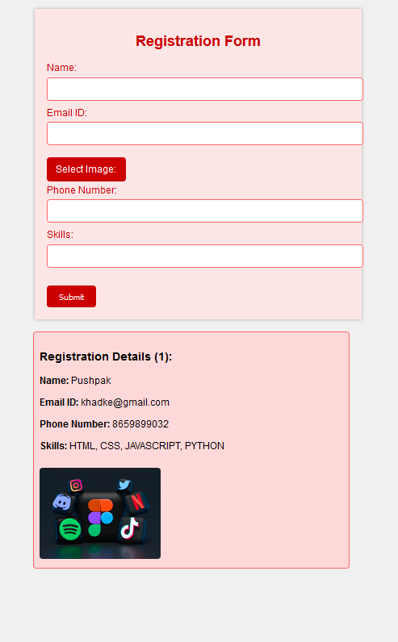

# Task 03 ( Registration Form )
[Live-In-Production Demo](https://pkregister.netlify.app/)_________________________________________ _Individual Project | Duration: 1 Hour_  
- Registration Form webpage.  
- This is a basic web Registration Form that i built using just pure HTML & CSS & JAVASCRIPT.

## 👨‍💻 Tech Stack
Tech : `HTML` `CSS` `JAVASCRIPT`  

Tools : `VS Code`

## 📝 I Learn
- HTML Tag and CSS Basics and JAVASCRIPT

## 📷 Screenshot

