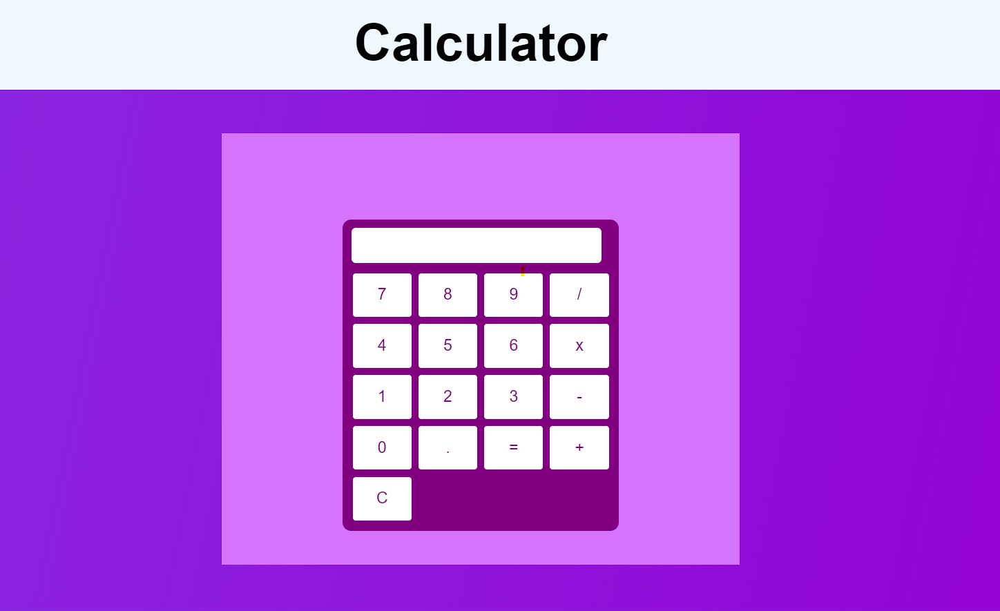

# Task 04 ( Calculator )
[Live-In-Production Demo](https://pkccalculator.netlify.app/)_________________________________________ _Individual Project | Duration: 45 Minutes_  
- Calculator webpage.  
- This is a basic web application that i built using just pure HTML & CSS & JAVASCRIPT.

## 👨‍💻 Tech Stack
Tech : `HTML` `CSS` `JAVASCRIPT`  

Tools : `VS Code`

## 📝 I Learn
- HTML Tag and CSS Grid and JAVASCRIPT

## 📷 Screenshot

